# 🚨 Real-Time Violence Detection using X3D

<div align="center">


**Deep Learning-based Video Anomaly Detection for Security Surveillance**


[](https://www.kaggle.com/code/santhoshakash/x3d-model-for-violence-detection)

</div>

---

## 🎯 Overview

Real-time violence detection system using **X3D (eXtended Xception 3D)** spatiotemporal model. Analyzes video streams to identify anomalous behaviors with **96% accuracy**.

```
┌────────────────────────────────────────┐
│  🎯 96% Accuracy                       │
│  📹 Real-Time CCTV Processing         │
│  🚨 Instant Alert System              │
│  🧠 X3D Deep Learning Model           │
│  ⚡ GPU Accelerated                   │
│  🖥️  Tkinter GUI Dashboard            │
└────────────────────────────────────────┘
```

---

## 🏗️ Architecture

```mermaid
%%{init: {'theme':'dark'}}%%
graph LR
    A[📹 Live Video] --> B[16-Frame<br/>Windows]
    B --> C[🧠 X3D Model]
    C --> D{Violence<br/>Detected?}
    D -->|Yes| E[🚨 Alert]
    D -->|No| F[✅ Normal]
    
    style A fill:#1a1a1a,stroke:#00d9ff,color:#fff
    style C fill:#1a1a1a,stroke:#ff00ff,color:#fff
    style E fill:#1a1a1a,stroke:#ff0000,color:#fff
    style F fill:#1a1a1a,stroke:#00ff00,color:#fff
```



---

## 🚀 Quick Start

```bash
# Clone repository
git clone https://github.com/santhoshmdu/Violence-detection-using-X3D.git
cd Violence-detection-using-X3D

# Install dependencies
pip install -r requirements.txt

# Download pre-trained model
# (Model available on Kaggle - link above)

# Run GUI application
python app.py
```

---

## ✨ Features

<table>
<tr>
<td width="50%">

### 🎥 Video Processing
- 16-frame temporal windows
- Batched inference
- GPU acceleration
- Real-time FPS counter

</td>
<td width="50%">

### 🚨 Alert System
- Audio warnings
- Visual notifications
- Snapshot capture
- Detection history log

</td>
</tr>
<tr>
<td width="50%">

### 🧠 X3D Model
- Spatiotemporal CNN
- 96% accuracy
- Confidence scoring
- Multi-threaded processing

</td>
<td width="50%">

### 🖥️ GUI Dashboard
- Live video feed
- Detection overlay
- FPS monitoring
- Control panel

</td>
</tr>
</table>

---

## 🛠️ Tech Stack

| Component | Technology |
|-----------|------------|
| **Deep Learning** | PyTorch, TensorFlow |
| **Model** | X3D (eXtended Xception 3D) |
| **Computer Vision** | OpenCV |
| **GUI** | Tkinter |
| **Processing** | Multithreading, GPU |

---

## 📊 Performance

| Metric | Value |
|--------|-------|
| **Accuracy** | 96% |
| **Precision** | 98%+ |
| **Inference Time** | <100ms |
| **FPS** | 15-30 (GPU) |

---

## 🎯 Use Cases

✅ **Security Surveillance** - Monitor CCTV feeds  
✅ **Public Safety** - Detect violent incidents  
✅ **Event Security** - Real-time crowd monitoring  
✅ **Smart Cities** - Automated threat detection

---


---

## 🔧 Configuration

```python
# config.py
MODEL_PATH = "model/weights/x3d_best.pth"
CONFIDENCE_THRESHOLD = 0.85
FRAME_WINDOW_SIZE = 16
GPU_ENABLED = True
ALERT_SOUND = True
```

---

## 🎓 Model Details

**X3D Architecture:**
- Efficient 3D CNN for video understanding
- Spatiotemporal feature extraction
- Trained on violence detection dataset
- Optimized for real-time inference

**Training:**
- Dataset: Annotated violence/normal videos
- Epochs: 100+
- Optimizer: Adam
- Loss: Cross-Entropy

---

## 🌐 Kaggle Model

📦 **Pre-trained Model & Training Code:**

[](https://www.kaggle.com/code/santhoshakash/x3d-model-for-violence-detection)

---

## 📸 Demo

> Add screenshots/GIF of the application in action

---

## 🤝 Contributing

Contributions welcome! Fork the repo and submit a PR.

---

## 📄 License

MIT License

---

## 👨‍💻 Author

**Santhosh Thiruvengadam**

[](https://github.com/santhoshmdu)
[](https://linkedin.com/in/santhoshmadurai)
[](https://www.kaggle.com/santhoshakash)

---

<div align="center">

**⭐ Star this repo if you find it useful!**

<sub>Built for safer communities 🛡️</sub>

</div>
